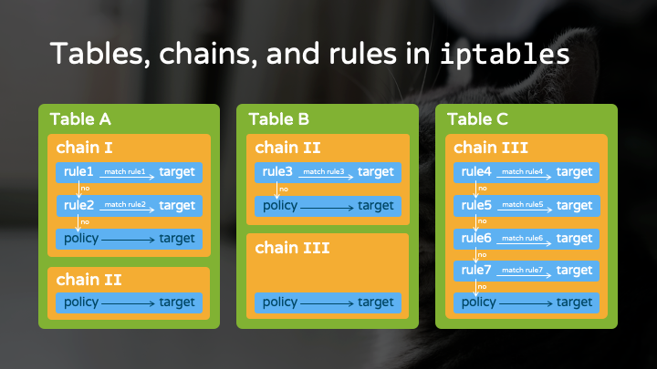

## 1. Which command would you use to create a tar archive called test.tar out of 3 files, called test1, test2 and test3?

A) tar -fc test.tar test1 test2 test3
(但要注意有些老版 tar 可能要求 -f 必須在最後一個選項之後緊跟檔案名，但 GNU tar 允許 -fc file 這種形式)

B) tar -cf test.tar test1 test2 test3

C) tar -xvf test.tar test1 test2 test3
(-x 是解壓（extract）)

D) tar -f test.tar test1 test2 test3

### Answer:

B) tar -cf test.tar test1 test2 test3

```bash
tar [選項] [歸檔檔案名稱] [要打包的檔案或目錄...]
```

常用選項：

    -c：建立（create）新的歸檔檔案

    -f：指定歸檔檔案的名稱

    -v：顯示詳細資訊（可選）

    -x：解開歸檔檔案

    -t：列出歸檔內容

## 2. You have connected a new HDD to a Linux machine but the device might not have been properly detected on boot. which command would be helpful in checking if the operating system has detected the HDD

這個設備可能在啟動時沒有被正確檢測到，現在要選一個命令來檢查操作系統是否檢測到了這塊 HDD

A) dmseg 用來顯示 kernel 開機訊息與硬體偵測的日誌
當你插入新的硬碟（或開機時偵測硬碟），kernel 會在環形緩衝區中記錄 SATA/USB/SCSI 設備的訊息，比如 sdb、sdc 等被偵測到的資訊，所以用 `dmesg | grep -i sd` 或 `dmesg | tail -20` 可以查看是否偵測到新硬碟
B) dd 用於資料轉換與複製的工具（例如寫入 ISO 到 USB，或複製硬碟）

C) du 查看檔案與目錄的磁碟使用量（disk usage）

D) dc 桌面計算器（逆波蘭表示法的計算器）

### Answer:

A) dmseg

## 3. Which set contains only tables from iptables?

A) filter, nat, mangle, raw, security

B) Input, Output, prerouting, postrouting, forward

C) accept, reject, drop, redirect

D) Input, Output, nat, filter

### Answer

A) filter, nat, mangle, raw, security

在 iptables 中，「表（tables）」 是用來分類不同類型的封包處理功能的。每個「表」包含若干「鏈（chains）」，而每個鏈中包含具體的「規則（rules）」，規則的動作（target）可能是 ACCEPT、DROP 等



iptables 裡面會有一個一個的 tables，每個 table 則會由多個 chains 所組成，而這些 chains 則由多個 rules 所構成。

依據對封包做的操作的不同，會有不同的 table，像是負責 network address translation 的 nat table、或負責封包過濾的 filter table
Chain 則是依據封包處理流程的不同階段所命名，像是在做 routing 之前（PREROUTING chain）、或者是處理完 routing 之後（POSTROUTING chain）。
Rule 就是我們所設定的防火牆規則。
每個 rule 都會有 target，target 就是要對這個封包做什麼「操作」。
當封包進入一個 chain，就會開始從該 chain 的第一條 rule 開始依序比對，假如該封包符合了第一個 rule，那就會對這個封包執行第一個 rule 所指定的「操作」，然後可能就會到下一個 chain 或被丟棄。
假如前面的 rule 都沒有符合，那就會去比對下一條 rule，依此類推。

> [reference](https://hackmd.io/@cpt/intro_to_iptables)

## 4. One of the employees is leaving your company. Which command would you issue (as root) to lock local access for this user?

A: passwd -l jdoe

-l（lock）命令會鎖定用戶密碼，即在 `/etc/shadow` 中密碼欄位前加上 !，使用戶無法用密碼登入

> [reference](https://blog.gtwang.org/linux/linux-passwd-command-examples/)

B: usermod -l jdoe 用來修改用戶登入名

> [reference](https://dywang.csie.cyut.edu.tw/dywang/linuxSystem/node58.html)

C: login -l jdoe 是用來登入系統的，-l 參數允許指定要登入的用戶，但這是由用戶自己執行的登入動作

> [reference](https://linux.vbird.org/linux_basic/centos7/0410accountmanager.php)

### Answer

A) passwd -l jdoe

## 5. You have received information that there has been a potential break-in attempt to one of the servers (Server1). What command chain can be used to get a sorted list of all IP addresses with failed authentication attempts from the SSH authentication logs, along with the usernames that were tried? Small caveat: due to a bug, one of your applications might occasionally try to log in to Server1 as user loki. Ignore any such attempts.

忽略用戶名為 loki 的記錄

Logfile (Ubuntu 16): `/var/log/auth.log`

要從 /var/log/auth.log 中找出 SSH 認證失敗的記錄

Sample matching logfile line: Jun 01 10:05:16 server1 sshd[12345]: Invalid user admin from 192.168.134.245

Example result:

```
192.168.134.201 admin
192.168.134.201 administrator
192.168.134.201 administrator
192.168.134.201 superuser
192.168.134.202 root
192.168.134.202 www
192.168.134.245 admin
192.168.134.245 admin1
192.168.134.245 root
```

A: awk '/Invalid user/ { print $10, $8 }' /var/log/auth.log | grep --invert-match loki | uniq -c | sort

用 awk 預設欄位分隔（空格）來分析，awk 最基本的用法就是改變輸出格式，`grep -v loki` 過濾掉包含 loki 的行（這裡是過濾輸出，但輸出只有 IP 用戶名，所以如果用戶名是 loki 就會被過濾掉），`uniq -c` 會統計次數，但題目沒有要求次數，只要求列表，sort 會按 IP 和用戶名排序

> [reference](https://www.hy-star.com.tw/tech/linux/awk/awk.html)

B: awk '/Invalid user/ /var/log/auth.log | awk '{ print $10, $8 }' | sort -a | uniq | grep -v loki

C: cat /var/log/auth.log | grep -v loki | cut -d'-' -f R9,8 | grep 'Invalid user' | sort | uniq

> [cut reference](https://blog.gtwang.org/linux/linux-cut-command-tutorial-and-examples/)

D: grep -v loki /var/log/auth.log | cut --delimiters=, --fields=10,0 --only-delimited | sort | uniq | grep 'Invalid user'

### Answer

A: awk '/Invalid user/ { print $10, $8 }' /var/log/auth.log | grep --invert-match loki | uniq -c | sort

## 6. You run the attached command, which is followed by the shown output. What's the most probable cause? Command: ping 8.8.8.8 -c 3 -i 3 Output:

`ping -i 3` 在 Linux 中 不是設定 TTL，而是設定 傳送封包的時間間隔（inter-packet interval）為 3 秒，TTL 的設定是 -t（在 Linux ping 中）或者在某些系統是 -T，但這裡沒有用，Linux ping 預設 TTL 通常是 64，所以這裡的 -i 3 與 TTL 無關，但輸出顯示 TTL 超時，代表封包在到達某個路由器（10.0.2.2）時 TTL 已經為 1（或者更少），然後該路由器減到 0，就回送 ICMP 超時

```
PING 8.8.8.8 (8.8.8.8) 56(84) bytes of data.
From 10.0.2.2 icmp_seq=1 Time to live exceeded
From 10.0.2.2 icmp_seq=2 Time to live exceeded
From 10.0.2.2 icmp_seq=3 Time to live exceeded
--- 8.8.8.8 ping statistics ---
3 packets transmitted, 0 received, +3 errors, 100% packet loss, time 5998ms
```

`From 10.0.2.2` 這個 IP 不是目標 8.8.8.8，而是途中的某個路由器，`Time to live exceeded` 表示封包的 TTL 在到達 10.0.2.2 這個節點時已經減到 0，因此該路由器丟棄封包並回送 ICMP Time Exceeded 訊息，代表封包根本沒到達 8.8.8.8，而是在中途就因為 TTL 用盡被丟棄

如果預設 TTL=64 卻在第 1 跳（10.0.2.2）就 TTL 超時，這很奇怪，因為 10.0.2.2 很可能是預設閘道或虛擬環境中的 NAT 設備，有可能是以下狀況：
網路設定有 routing loop，導致封包在幾個路由器之間來回，TTL 快速耗盡，而回覆的 ICMP 超時訊息來源是 10.0.2.2、防火牆或中間路由器故意將 TTL 減到 0 是不太常見、主機的 TTL 設定被改為 1（例如 ping -t 1 會導致第一跳就超時），但題目給的命令沒有 -t 參數，所以 TTL 應該是預設值 64，不該在第一跳就超時，因此，這更可能是網路路由問題，而不是 TTL 設太低的問題

A: Host with IP 8.8.8.8 is down and you should inform its owner about this.

B: Something is wrong with your networking card.

網卡故障通常會導致連本地閘道都 ping 不通，或者沒有傳送，不會收到 ICMP 超時訊息

C: Option "-i 3" sets the time to live value too low, you should try to increase it and see what happens.

-i 3 是間隔時間，不是 TTL，如果真的是 TTL 設太低，我們可以用 ping -t 2 測試

D: This could be a network issue and additional tests need to be ran.

### Answer

D: This could be a network issue and additional tests need to be ran.

因為 TTL 超時表示路由可能有迴圈或設定問題，需要進一步用 traceroute 或檢查路由表來診斷

TTL（Time To Live）是 IP 封包中的一個欄位，每經過一個路由器（一跳）就減 1，當 TTL 變成 0 時，路由器會丟棄該封包並回送 ICMP Time Exceeded 訊息

## 7. Given the attached commands, what would the output be? Assume you are working in a basic terminal.

```text

A=( " bash arrays are cool" )

echo ${A[0]}
```

Options:

A: a double quote mark ''

B: 1 space character

C: word bash

D: phrase bash arrays are cool

E: letter B

### Answer

D: phrase bash arrays are cool

在 Bash 中，當你用 A=( ... ) 賦值時，每個在括號內用雙引號包起來的部分是一個元素，不管裡面有多少空格

## 8. Which command can be used to disable the network interface eth0?

哪個指令可以用來停用網路介面 eth0？也就是讓 eth0 進入 down 狀態，停止網路連線

Options:

A: ip link set eth0 down

現代 Linux 系統推薦的工具 iproute2 的指令

> [reference](https://linux.vbird.org/linux_server/centos6/0140networkcommand.php)

B: ethtool -s eth0 mdix off

用來檢視與修改網路卡驅動程式參數，mdix off 是設定乙太網路線自動偵測（Auto-MDIX）關閉，與啟用/停用介面無關

> [reference](https://blog.csdn.net/qq_37037348/article/details/132691062)

C: ifconfig eth0 --down

ifconfig 指令用來設定網路介面，正確語法是 ifconfig eth0 down，沒有 --down 這種參數

> [reference](https://pjchender.dev/app/app-linux-ifconfig/)

D: if down eth0

`/etc/network/interfaces` 的 `ifup/ifdown` 指令，但正確用法是 `ifdown eth0`，不是 if down eth0

### Answer

A: ip link set eth0 down

題目要求「停用（disable）網路介面 eth0」，也就是將其狀態設為 down

## 9. The attached script is placed in the user's home directory, and is then run from there with the shown command. What would its outcome be?

Command: ./script www.google.com 5

Script:

```bash

#!/bin/bash
PATH="./"
LOGNAME="logfile"

if [[ -n $1 ]] && [[ -n $2 ]]; then
 PING_ADDRESS=$1
 REPETITIONS=$2
 ping $PING_ADDRESS -c $REPETITIONS >> ${PATH}${LOGNAME} 2>/dev/null
else
 echo "Missing arguments!"
fi
```

PATH="./" 這裡把 PATH 環境變數覆蓋為 "./"，意味著系統只會在當前目錄下尋找可執行文件，因為 ping 找不到，ping ... 這行命令會失敗，錯誤訊息會被導向 2>/dev/null（丟棄），標準輸出本來要附加到 ./logfile，但 ping 根本沒執行，所以 logfile 不會收到任何內容，腳本不會顯示 "Missing arguments!"，因為參數 www.google.com 和 5 都有提供

因為 PATH 只有 ./，shell 在當前目錄找不到 ping，錯誤訊息發送到 stderr，但被 2>/dev/null 丟棄，沒有 stdout 輸出（因為 ping 沒執行），logfile 沒有被寫入任何內容

Options:

A: www.google.com address would get pinged 5 times, and outcome of the command would get saved in file called 'logfile' located in users current working directory.

錯誤，因為 ping 命令找不到

B: ping: command not found message would get saved in file called 'logfile' located in users current working directory.

錯誤，因為 stderr 被導向 /dev/null，不會寫入 logfile

C: No output would get generated (neither to standard output nor to the logfile), but www.google.com address would still be pinged.

錯誤，ping 沒有執行

D: No output would get generated (neither to standard output nor to the logfile) and www.google.com address would not get pinged.

沒有 stdout/stderr 輸出，也沒有執行 ping

### Answer

## 10. One of the servers is having problems: almost all of the disk space in the root partition is being used up and you have no idea why! what command would help you to analyze the disk contents and identify the cause of the lost space ?

    伺服器的根分區（/）磁碟空間快滿了，不知道原因，需要一個指令來分析磁碟內容，找出是哪個檔案或目錄佔用大量空間，這是一個「找出哪個檔案/目錄佔用空間」的問題，而不是只看使用量的統計

    a) du -ahd1 /

    du（disk usage）是用來計算檔案與目錄的磁碟使用量，`-a` 顯示檔案與目錄（不過與 `-d1` 一起使用時，通常只顯示目錄，除非有檔案在根目錄下）。`-h` 人類可讀的單位（KB、MB、GB）。`-d1` 只深入到第 1 層（即只顯示根目錄下第一級子目錄的總使用量）。這個指令能快速看出 / 下哪個子目錄佔用最大空間，是常用的空間排查指令

    b) df -ah /

    df（disk free）顯示檔案系統的磁碟使用情況（分區級別）。它只會告訴你根分區使用了多少百分比，但不會告訴你哪個目錄或檔案佔用空間

    c) dc -e size /

    dc 是一個桌面計算器（逆波蘭表示法計算器），與磁碟空間分析無關

    d) ls -al /

    目錄的大小顯示的是該目錄 metadata 的大小，不是該目錄下所有內容的總大小

### Answer

a) du -ahd1 /

會列出 / 下每個子目錄和檔案的大小，很適合找出佔用最多空間的地方
